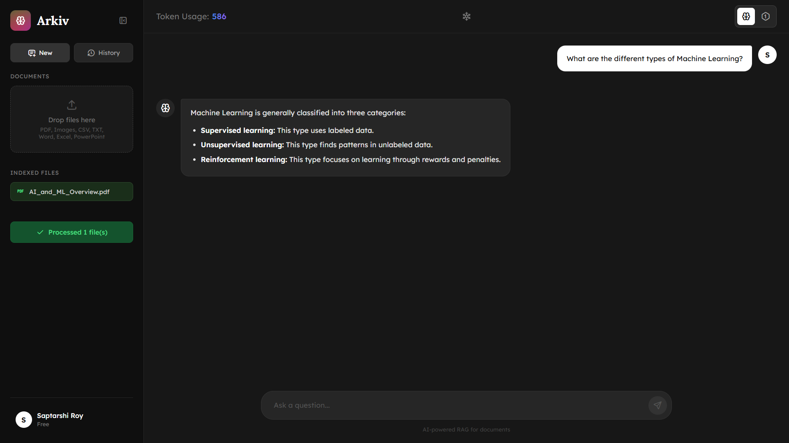

<h1 align="center"><b>Arkiv</b></h1>

<p align="center">
  <a href="https://arkiv.hirishi.in/"><b>Arkiv</b></a> is an AI-powered document assistant that lets you upload files and have intelligent conversations about their content. Built with <a href="https://fastapi.tiangolo.com"><b>FastAPI</b></a> and <a href="https://python.langchain.com"><b>LangChain</b></a>, powered by <a href="https://ai.google.dev"><b>Google Gemini 2.0 Flash</b></a>, Arkiv uses RAG (Retrieval Augmented Generation) to provide accurate, context-aware answers from your documents.
</p>

---

## ✨ Features

| FEATURE                     | DESCRIPTION                                           | TECHNOLOGY                                        |
|-----------------------------|-------------------------------------------------------|---------------------------------------------------|
| 📄 **Document Upload**      | PDF, DOCX, XLSX, CSV, PPTX, images, and text files    | ***pdfplumber***, ***python-docx***, ***pandas*** |
| 🤖 **AI-Powered Q&A**       | Ask questions and get accurate answers from documents | ***Gemini 2.0 Flash***                            |
| 🖼️ **Image Analysis**       | Description and text extraction from images via AI    | ***Gemini Vision***                               |
| 🔑 **BYOK Support**         | Use your own Google Gemini API key                    | ***Built-in***                                    |
| 💬 **Chat History**         | Save and restore conversations with local storage     | ***Built-in***                                    |
| 🔐 **User Authentication**  | Login, signup with OTP & Google OAuth                 | ***Supabase Auth***                               |
| 🧠 **Vector Search**        | Semantic search using embeddings for retrieval        | ***Pinecone***, ***LangChain***                   |
| ⚡ **Real-time Processing** | Fast chunking and indexing for instant querying       | ***LangChain Text Splitters***                    |
| 🎨 **Modern UI**            | Responsive interface with dark mode and animations    | ***Vanilla JS***, ***Vanilla CSS***               |
| 📊 **Data Management**      | Manage chat history and knowledge base in settings    | ***Built-in***                                    |

---

## 🎯 System Overview

Arkiv uses a RAG (Retrieval-Augmented Generation) architecture with LangChain, secure multi-user support, and per-user data isolation via Pinecone namespaces. The frontend is served directly by FastAPI for simplified deployment without Node.js.



---

## 🏗️ Architecture

| #  | COMPONENT           | DESCRIPTION                                      | STACK                                             |
|----|---------------------|--------------------------------------------------|---------------------------------------------------|
| 1️⃣ | **Frontend**        | SPA with auth, chat, settings, and file upload   | ***Vanilla JS***, ***Vanilla CSS***               |
| 2️⃣ | **Backend**         | File processing, embeddings, and chat API        | ***FastAPI***, ***Python***                       |
| 3️⃣ | **Ingestion**       | Document reading, text cleaning, and chunking    | ***LangChain***, ***pdfplumber***, ***pandas***   |
| 4️⃣ | **Vector Store**    | Embedding storage and similarity search          | ***LangChain Pinecone***                          |
| 5️⃣ | **LLM Layer**       | Context-aware Q&A from document chunks           | ***LangChain***, ***Gemini 2.0 Flash***           |
| 6️⃣ | **Auth & Database** | User auth, sessions, and conversation storage    | ***Supabase***                                    |

---

## 📁 Supported File Types

| TYPE          | EXTENSIONS                       |
|---------------|----------------------------------|
| Documents     | `.pdf`, `.docx`                  |
| Spreadsheets  | `.xlsx`, `.csv`                  |
| Presentations | `.pptx`                          |
| Images        | `.png`, `.jpg`, `.jpeg`, `.webp` |
| Text          | `.txt`, `.md`, `.json`           |

---

## 📦 Project Structure

```
Arkiv/
├── client/                # Frontend application
│   ├── chat/                 # Chat components
│   ├── core/                 # Core utilities (auth, config, etc.)
│   ├── header/               # Header component
│   ├── settings/             # Settings tabs (Account, API Keys, Data, About)
│   ├── sidebar/              # Sidebar components
│   ├── styles/               # CSS stylesheets
│   └── index.html            # Main HTML entry point
├── server/                # Backend FastAPI application
│   ├── read/                 # File readers (PDF, DOCX, Excel, CSV, PPTX, Image, Text)
│   ├── services/             # Business logic (upload, chat, utils)
│   ├── storage/              # Pinecone vector store
│   ├── app.py                # FastAPI app initialization
│   ├── config.py             # Configuration & environment variables
│   ├── dependencies.py       # Auth & request helpers
│   ├── models.py             # Pydantic request/response schemas
│   └── routes.py             # API endpoints
├── requirements.txt       # Python dependencies
├── Dockerfile             # Docker configuration
├── .env                   # Environment variables
└── README.md              # This file
```

---

<p align="center">
  Made with 💙 by <a href="https://arkiv.hirishi.in/">Saptarshi Roy</a>
</p>
