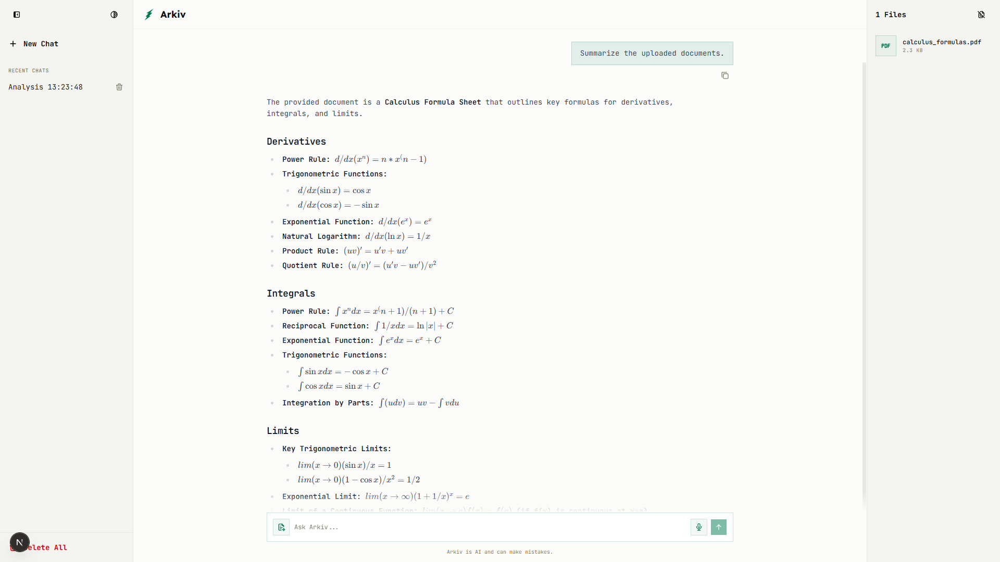

<h1 align="center">
  
  <br>
  <b>Arkiv</b>
</h1>

<p align="center">
  <a href="https://arkiv.hirishi.in"><b>Arkiv</b></a> is an intelligent, document-grounded conversational assistant. Built with a <a href="https://nextjs.org"><b>Next.js</b></a> frontend and a <a href="https://fastapi.tiangolo.com"><b>FastAPI</b></a> backend, it leverages <b>Retrieval-Augmented Generation (RAG)</b> to let you upload various document formats and query their contents using natural language.
</p>

---

## ⚡ _Supported Formats_

| FORMAT                   | LOADER                  | SUPPORT      |
| ------------------------ | ----------------------- | ------------ |
| **PDF _(.pdf)_**         | PyMuPDF4LLMLoader       | ✅ Supported |
| **CSV _(.csv)_**         | UnstructuredCSVLoader   | ✅ Supported |
| **Text _(.txt)_**        | TextLoader              | ✅ Supported |
| **Markdown _(.md)_**     | UnstructuredMarkdown    | ✅ Supported |
| **JSON _(.json)_**       | JSONLoader              | ✅ Supported |
| **LaTeX _(.tex)_**       | TextLoader              | ✅ Supported |
| **Word _(.docx)_**       | UnstructuredWordLoader  | ✅ Supported |
| **Excel _(.xlsx)_**      | UnstructuredExcelLoader | ✅ Supported |
| **PowerPoint _(.pptx)_** | UnstructuredPPTLoader   | ✅ Supported |

---

## 🎯 _System Overview_

Arkiv uses a decoupled architecture with a **Next.js** frontend and a **FastAPI** backend, connected over REST with real-time **SSE streaming** for LLM responses. The RAG pipeline processes diverse document types, chunks the text, embeds it using an **Embedder**, and stores it in a **Pinecone** vector database, ensuring highly accurate, context-aware responses and reducing hallucinations typical of standard LLMs.



---

## 🏗️ _Architecture_

| #   | COMPONENT        | DESCRIPTION                                     | STACK                                                                |
| --- | ---------------- | ----------------------------------------------- | -------------------------------------------------------------------- |
| 1️⃣  | **Frontend**     | Chat interface for querying documents           | **_TypeScript_**, **_Next.js_**, **_Tailwind CSS_**, **_shadcn/ui_** |
| 2️⃣  | **Backend**      | REST API handling file processing and LLM chat  | **_Python_**, **_FastAPI_**, **_Uvicorn_**                           |
| 3️⃣  | **RAG Pipeline** | Ingestion, chunking, and embedding logic        | **_Python_**, **_LangChain_**, **_Pinecone_**                        |
| 4️⃣  | **Chat Engine**  | Context-aware chat with real-time SSE streaming | **_FastAPI SSE_**, **_LangChain_**                                   |

---

## 📁 _Project Structure_

```
Arkiv/
├── frontend/               # Next.js frontend
│   ├── app/                # Pages
│   │   ├── page.tsx        # Home
│   │   ├── chat/           # Chat interface
│   │   └── layout.tsx      # Root layout
│   ├── components/         # UI components (shadcn) + custom components
│   ├── lib/                # Utilities
│   ├── hooks/              # Custom React hooks
│   └── public/             # Static assets
├── backend/                # FastAPI backend
│   └── app/
│       ├── main.py         # FastAPI app entry point
│       ├── config.py       # App configuration
│       ├── routes/         # API route definitions
│       ├── rag/            # RAG pipeline implementations
│       │   ├── loader.py   # Document loaders
│       │   ├── chunker.py  # Text splitting
│       │   ├── embedder.py # Vector embeddings
│       │   ├── vectorstore.py # Pinecone integration
│       │   ├── cleaner.py  # Text sanitization
│       │   └── pipeline.py # E2E processing
│       └── static/         # Static files
├── docs/                   # Documentation and reports
├── README.md
└── .gitignore
```

---

## 📖 _Instructions_

For detailed setup and usage instructions, refer to the respective README files:

- 🖥️ [**_`Backend Instructions`_**](./backend/README.md) - Setting up & running the FastAPI backend
- 🌐 [**_`Frontend Instructions`_**](./frontend/README.md) - Setting up & running the Next.js frontend

---

<p align="center">
  Made with ⚡ by <a href="https://hirishi.in">Saptarshi Roy</a> & <a href="https://itskdhere.com">Krishnendu Das</a>
</p>
